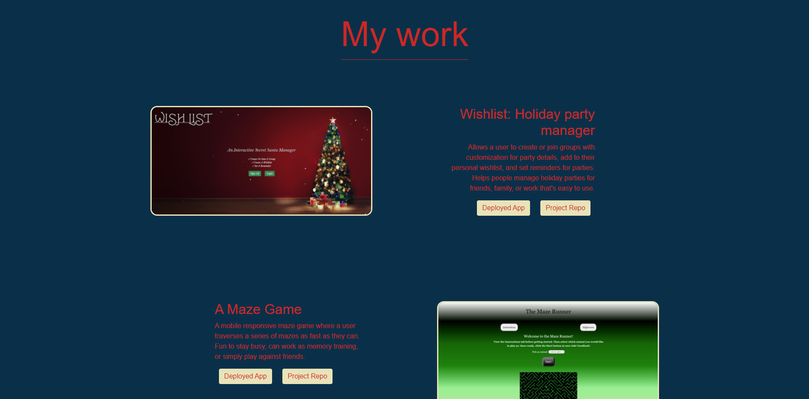

# Phalen Portfolio

## Description

This is the third iteration of my professional portfolio in addition to being my week 16 homework assignment for the fall part time full stack coding bootcamp. I redid my portfolio from scratch to
add a better layout, color scheme, more responsiveness, and all around sharper look. I've updated my 2 of my projects with ones I completed during the 2nd 8 weeks of the bootcam.

## Technology Utilized

This portfolio will be based off HTML and CSS files as well as using bootstrap as a framework.

Tools included in this portfolio:

* CSS variables
* flexbox
* Bootstrap

## Objective

The objective is to create a responsive portfolio page that highlights my best work as a developer and provides insight to potential employers of the projects that I've worked on in the past and what I'm capable of as a web developer. Cheers!
## Submission

Check out my portfolio here: [Click here to view my portfolio!](https://phalenh.github.io/phalen-portfolio/)

